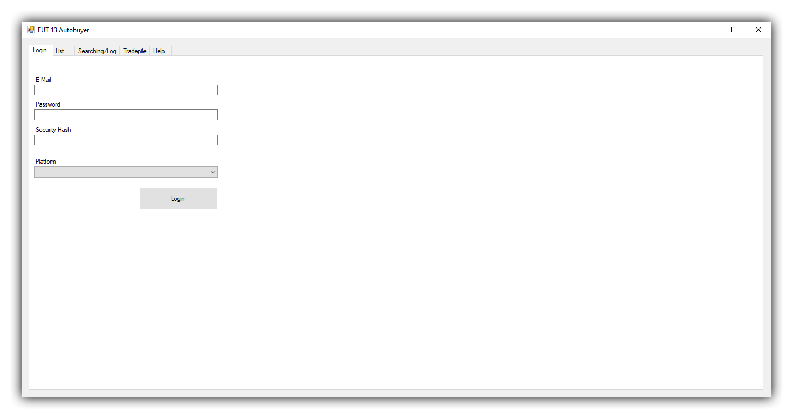
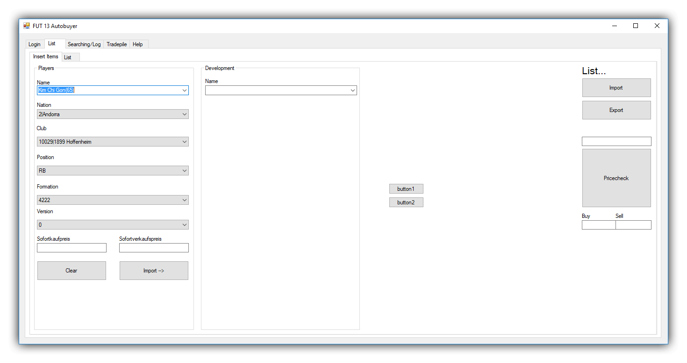
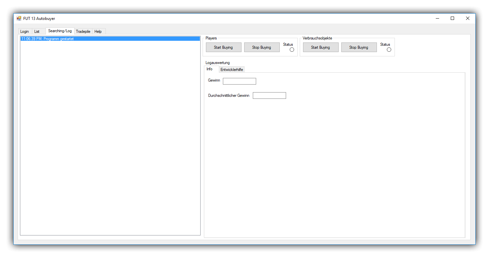

# FifaUltimateTeam13Autobuyer by <a href="https://github.com/igeligel">igeligel</a>

> This project was developed in 2012-2013 and will not be developed further or is gonna work. It is just there to showoff one of the oldest codebases of me. Please do not take this code serious!

> Automated trading platform for FIFA 13 Ultimate Team written in C# as Windows Forms application.

## Showcase/Architecture

An autobuyer for the trading platform of FIFA 13 Ultimate Team written in 2012-2013.

  
<b>In-app screenshots</b>

  

  

  

## Dependencies

  
<b>development</b>

  | Dependency | Version |
  | ---------- | ------- |
  | Visual Studio        | > 2017  |
  | .NET | 4.7.1  |

## Installation

Since this program never had any build thing since i was running this program always in a development evironment just start with opening the `.sln` file for the project and debug it. You need to set a path in the `app.config` file which should point to the player database as JSON file. You can find a viable player database in this [gist](https://gist.github.com/igeligel/1145370313310168dca827339e6e5484).

## Contact

## Contributors

<table><thead><tr><th align="center"><a href="https://github.com/igeligel"> igeligel</a> 
Contributions: 4
</th></tbody></table>

## License

*FifaUltimateTeam13Autobuyer* is realeased under the [MIT License](/LICENSE).
